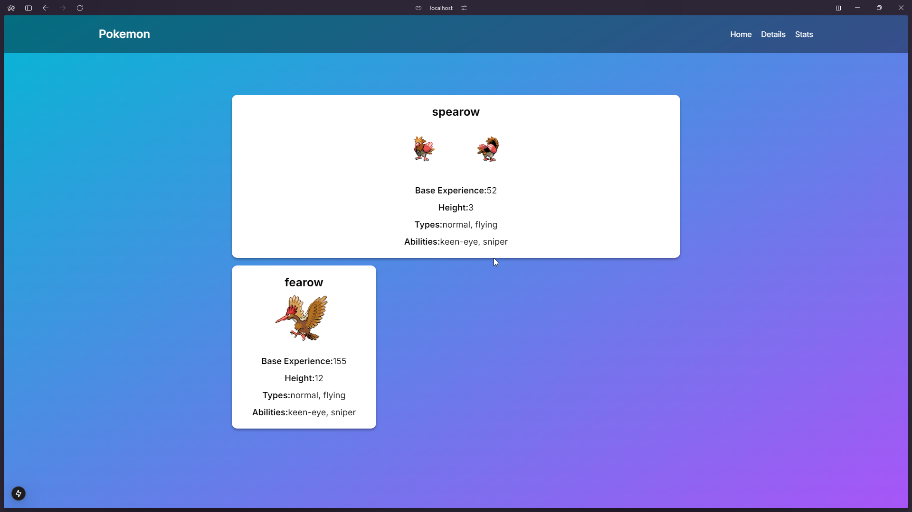
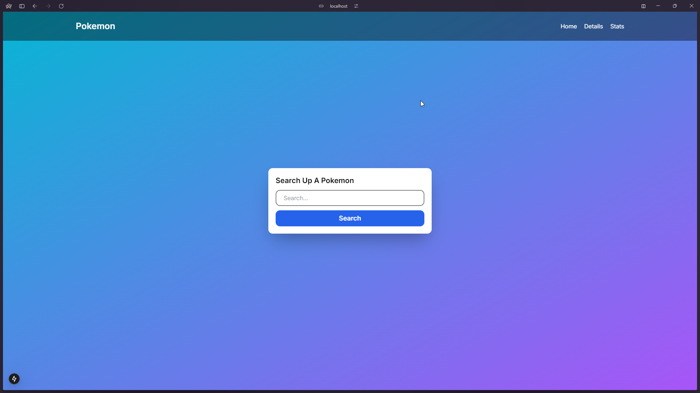
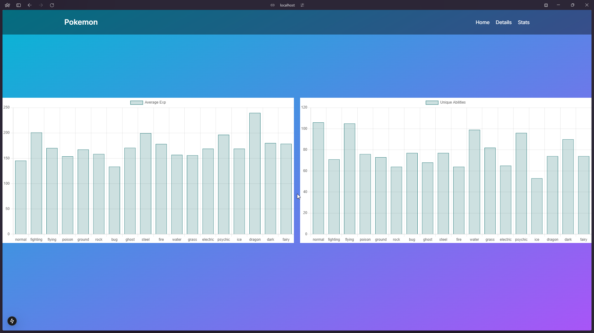
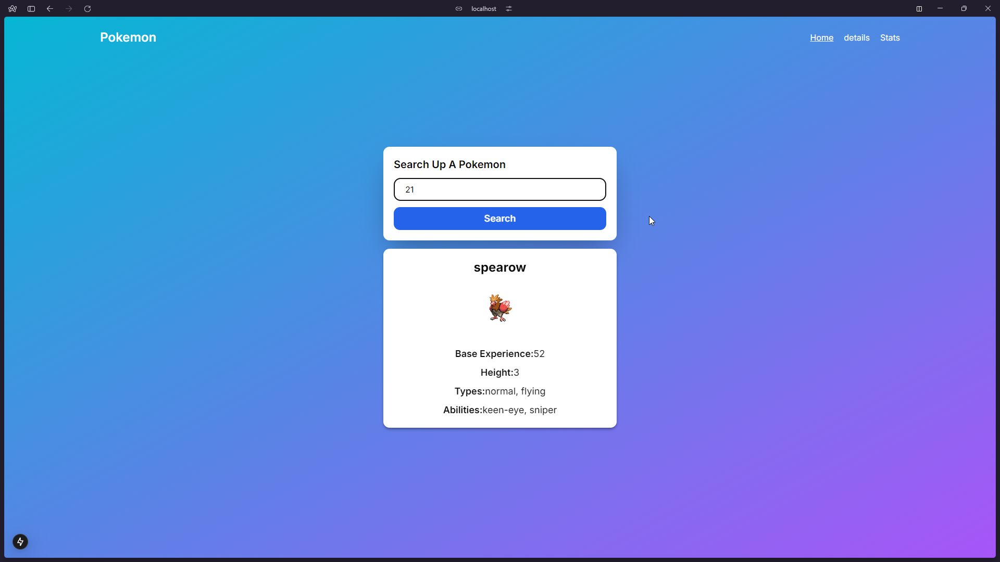

# Pokemon Search Website

# How to Run

## Clone the repository

```bash
git clone https://github.com/Xenos112/pokemon-search.git
cd pokemon-search
```

## Install dependencies

```bash
npm i
```

## Run the app

```bash
npm run dev
```

## Build the app

```bash
npm run build
```

## ScreenShots and Demos





